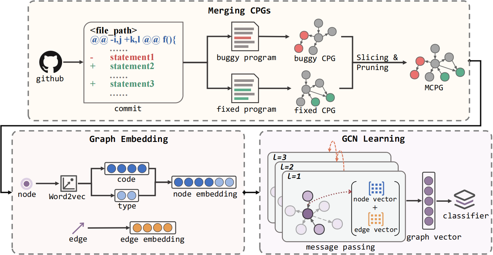

<div align="center">
    <p>
    <h1>
    GRAPE - Implementation
    </h1>
    <a href="https://github.com/han-mei/GRAPE"></a>
    <a href="https://github.com/han-mei/GRAPE"></a>
</div>


## Description
Learning Graph-based Patch Representations for Identifying and Assessing Silent Vulnerability Fixes

Software projects are dependent on many third-party libraries, therefore high-risk vulnerabilities can propagate through the dependency chain to downstream projects. Owing to
the subjective nature of patch management, software vendors commonly fix vulnerabilities silently. Silent vulnerability fixes cause downstream software to be unaware of urgent security issues in a timely manner, posing a security risk to the software. Presently, most of the existing works for vulnerability fix identification only consider the changed code as a sequential textual sequence, ignoring the structural information of the code. 

In this paper, we propose GRAPE, a GRAph-based Patch rEpresentation that aims to 1) provide a unified framework for getting vulnerability fix patches representation; and 2) enhance the understanding of the intent and potential impact of patches by extracting structural information of the code. GRAPE employs a novel joint graph structure (MCPG) to represent the syntactic and semantic information of silent fix patches and embeds both nodes and edges. Subsequently, a carefully designed graph convolutional neural network (NE-GCN) is utilized to fully learn structural features by leveraging the attributes of the nodes and edges. Moreover, we construct a dataset containing 2251 silent fixes. For the experimental section, we evaluated patch representation on three tasks, including vulnerability fix identification, vulnerability types classification, and vulnerability severity classification. Experimental results indicate that, in comparison to baseline methods, GRAPE can more effectively reducefalse positives and omissions of vulnerability fixes identification and provide accurate vulnerability assessments.



## Requirement
Our code is based on Python3 (>= 3.8). There are a few dependencies to run the code. The major libraries are listed as follows:

- torch (==2.0.1)
- pyg (==2.4.0)
- torch_scatter (==2.1.2+pt20cu118)
- torch-cluster (==1.6.3+pt20cu118)
- torch-sparse (==0.6.18+pt20cu118)
- numpy (==1.24.3)
- pandas (==2.0.3)
- tqdm (==4.65.0)

## Dataset
The dataset is in the `~/GRAPE/data/` folder
- commit_label.csv for vulnerability fix identification task
- commit_cwe.csv for vulnerability types classification task
- commit_cve.csv for vulnerability severity classification task 
- dataset.csv : vulnerability fix dataset
## How-to-Run
### Preprocess
1. Using `Joern` to generate CPGs
In `~/GRAPE/`, run the command:
```shell
sudo python3 generate_cpg.py
```
2. Merging CPGs to MCPG
```shell
python3 merge_cpg.py
```

### Train 
1. Processing MCPG into vectors
```shell
python3 preprocess.py
```
2. Training the model
```shell
python3 train.py
```
## 5. Team
The GRAPE package was developed by Institute of Software Engineering, Southeast University(ISEU).
